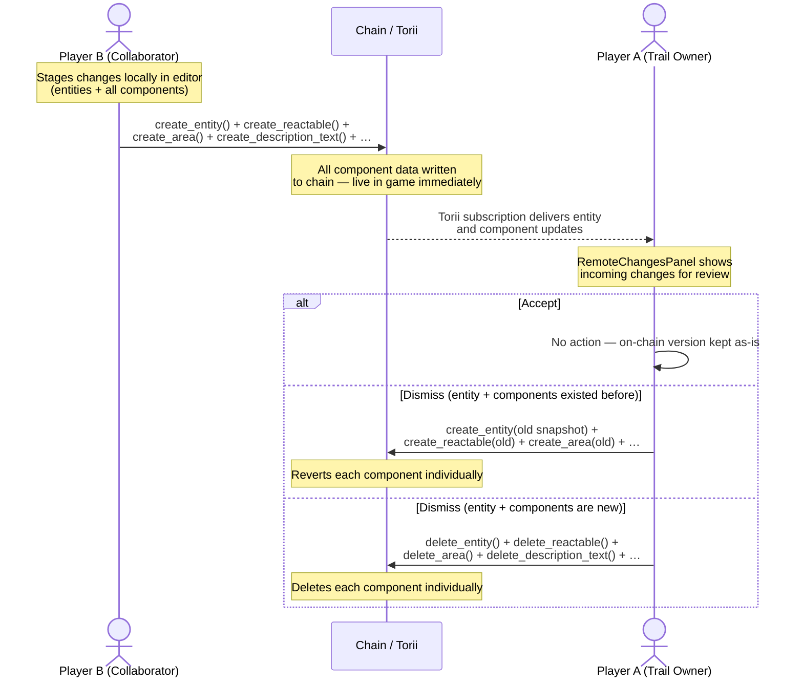
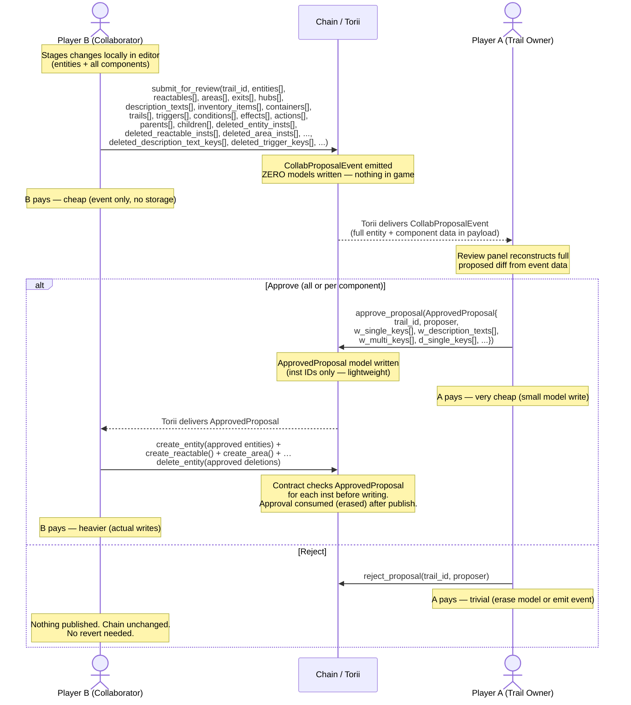

# Collaborative Trail Editing — Approval Flow Options

Two design options for gating how collaborator changes reach the chain.

---

## Option 1 — Client-side only (no contract changes) 

**DECIDED TO NOT IMPLEMENT**

Player B publishes directly to the chain. Player A reviews after the fact and can accept (keep) or dismiss (revert/delete). Player A pays for any revert transactions.



### What is on-chain during review

```
Timeline ─────────────────────────────────────────────────────────────────►

  Player B publishes        Player A reviews          Player A acts
        │                         │                        │
        ▼                         ▼                        ▼
  ┌───────────────────┐    ┌──────────────┐    Accept  → ┌─────────────────┐
  │ B's entity data   │    │ B's entity   │               │ B's version     │
  │ B's reactable     │───►│ + components │               │ stays on chain  │
  │ B's description   │    │ live in game │               └─────────────────┘
  │ B's area          │    └──────────────┘    Dismiss → ┌─────────────────┐
  │ ALL ON CHAIN      │                                   │ A re-publishes  │
  └───────────────────┘                                   │ every component │
                                                          │ (or deletes all)│
                                                          └─────────────────┘
```

### Contract changes required
**None.**

### Client changes required

| Area | File(s) | Change |
|---|---|---|
| Before-state snapshot | `editor.data.ts` | Before applying a Torii collaborator update to `dataPool`, snapshot the FULL previous entity collection (entity + all components) from `syncPool` |
| RemoteChangesPanel — Accept | `RemoteChangesPanel.tsx` | No-op (everything already on chain) |
| RemoteChangesPanel — Dismiss (existing) | `RemoteChangesPanel.tsx` | Re-publish every component individually using old snapshots |
| RemoteChangesPanel — Dismiss (new) | `RemoteChangesPanel.tsx` | Delete entity + all components individually |
| Visual pending state | `HierarchyTree.tsx` | Badge on entities and components awaiting review |
| Detect collaborator changes | `editor.data.ts` | Route Torii updates from collaborators into review queue per entity |

### Tradeoffs

| | |
|---|---|
| ✅ Zero contract changes | |
| ✅ Simpler proposal logic | |
| ❌ All component data is **live in game** until Player A acts | |
| ❌ Dismiss is expensive — one `create_*` or `delete_*` per component type per entity. 10 entities × 5 components = up to 50 transactions | |
| ❌ Player A pays for all revert transactions | |
| ❌ Player A must be online to revert; every hour offline = longer exposure of unapproved content | |
| ❌ `creator_address` for new entities becomes Player B (correct, since B is the caller) | |

---

## Option 2 — Full proposal event + two-phase commit (recommended)

Player B never writes any model data to the chain. They emit a single proposal event containing the full entity + component snapshot. Player A approves with a lightweight transaction. Player B then publishes the approved data and **pays for their own work**.

### How Dojo events work

A Dojo event is fundamentally different from a model:

```cairo
// A MODEL — writes a storage slot in the World contract
#[dojo::model]
pub struct Entity { ... }
world.write_model(@entity);     // ← storage cost, on-chain state changes

// AN EVENT — writes nothing to World storage
#[dojo::event(historical: false)]
pub struct CollabProposalEvent { ... }
world.emit_event(@proposal);    // ← no storage cost, emitted into the tx receipt
```

When `world.emit_event` is called:
1. The event data is serialized and emitted into the Starknet **transaction receipt** — the World contract writes **zero storage**
2. Torii watches every transaction, detects the event, deserializes it, and stores it in its own off-chain database
3. Client apps query or subscribe to that data via the Torii SDK

With `historical: false`, Torii keeps only the **latest emission per key combination** — if B resubmits a revised proposal it overwrites the previous one and Player A always sees the most current version.

### Where the data lives at each stage

```
B's browser          Transaction / Chain            Torii (off-chain index)        World State (on-chain models)
─────────────        ───────────────────────        ───────────────────────────    ─────────────────────────────

[staged in           submit_for_review() tx    →    CollabProposalEvent stored     ← nothing written here
 dataPool]           emits the event                in event_messages table
                     with ALL entity +              queryable by (trail_id,
                     component data                 proposer) — latest only

                     approve_proposal() tx    →     ApprovedProposal visible   →   ApprovedProposal written
                                                    in Torii models                to World state
                                                    (inst IDs only, no data)       (cheap, no entity data)

B reads approval     create_entity() +        →                               →    Entity + components
from Torii,          create_reactable() + …                                        written to World state
calls publish        delete_entity() for                                           ApprovedProposal consumed
                     approved deletions
```

| Stage | Where entity + component data lives | World state |
|---|---|---|
| B staging locally | Browser `dataPool` only | Nothing |
| After `submit_for_review` | `CollabProposalEvent` in Torii (event payload) | Nothing |
| After `approve_proposal` | Event still in Torii + `ApprovedProposal` model | `ApprovedProposal` (inst IDs only) |
| After B publishes | Entity + component models | Entity + components live |

### The full flow



### What is on-chain during review

```
Timeline ─────────────────────────────────────────────────────────────────►

  B submits proposal      A reviews             A acts            B publishes
        │                     │                   │                    │
        ▼                     ▼                   ▼                    ▼
  ┌───────────────┐    ┌────────────┐   Approve → ┌──────────┐  ┌────────────────┐
  │ Proposal      │    │ Event data │              │ Approved │  │ Entity +       │
  │ EVENT in      │───►│ in Torii   │              │ Proposal │  │ components     │
  │ Torii only    │    │            │              │ model    │  │ live in game   │
  │               │    │ Game:      │   Reject  → ┌──────────┐  └────────────────┘
  │ Game: clean   │    │ clean      │              │ Nothing. │
  └───────────────┘    └────────────┘              │ No revert│
                                                   └──────────┘
```

### How Player A knows something is pending

A subscribes to `CollabProposalEvent` filtered by their owned `trail_id`s. The state is determined by combining the event and model:

| `CollabProposalEvent` in Torii | `ApprovedProposal` model | State |
|---|---|---|
| Yes | No | **Pending** — A needs to review |
| Yes | Yes | **Approved** — waiting for B to publish |
| No | No | Idle — nothing pending |

### `creator_address` behavior

Since B is the one calling `create_entity` during publish, `get_caller_address()` = B naturally:

| Entity type | `creator_address` | Correct? |
|---|---|---|
| Modified (existed, created by A) | Preserved as Player A | ✅ |
| New (proposed by B, approved by A, published by B) | Player B (B is the caller) | ✅ |

No extra contract logic needed — the two-phase commit resolves this for free.

### Contract changes required

**1 new event** (`historical: false` — latest proposal per collaborator per trail):

```cairo
#[derive(Drop, Serde)]
#[dojo::event(historical: false)]
pub struct CollabProposalEvent {
    #[key]
    pub trail_id: u128,
    #[key]
    pub proposer: ContractAddress,
    // entity base
    pub entities:             Array<Entity>,
    // components (empty arrays if no changes for that type)
    pub reactables:           Array<Reactable>,
    pub areas:                Array<Area>,
    pub exits:                Array<Exit>,
    pub hubs:                 Array<Hub>,
    pub description_texts:    Array<DescriptionText>,
    pub inventory_items:      Array<InventoryItem>,
    pub containers:           Array<Container>,
    pub trails:               Array<Trail>,
    // multi-key components
    pub triggers:             Array<Trigger>,
    pub conditions:           Array<Condition>,
    pub effects:              Array<Effect>,
    pub actions:              Array<Action>,
    // relationships
    pub parents:              Array<ParentToChildren>,
    pub children:             Array<ChildToParent>,
    // entity-level deletions
    pub deleted_entity_insts:          Array<felt252>,
    // component-level deletions — single-key types (flat list of inst values)
    pub deleted_reactable_insts:       Array<felt252>,
    pub deleted_area_insts:            Array<felt252>,
    pub deleted_exit_insts:            Array<felt252>,
    pub deleted_container_insts:       Array<felt252>,
    pub deleted_inventory_item_insts:  Array<felt252>,
    pub deleted_hub_insts:             Array<felt252>,
    pub deleted_trail_insts:           Array<felt252>,
    pub deleted_parent_insts:          Array<felt252>,
    pub deleted_child_insts:           Array<felt252>,
    // component-level deletions — multi-key types (flat [inst, key, ...] pairs)
    pub deleted_description_text_keys: Array<felt252>,
    pub deleted_trigger_keys:          Array<felt252>,
    pub deleted_condition_keys:        Array<felt252>,
    pub deleted_effect_keys:           Array<felt252>,
    pub deleted_action_keys:           Array<felt252>,
}
```

The 14 `deleted_*` arrays carry per-component deletion proposals so the review panel can show the owner exactly which individual components are being removed, enabling per-component accept/reject. The actual on-chain approval gate uses the existing `d_single_keys`, `d_description_texts`, and `d_multi_keys` arrays in `ApprovedProposal` — no new approval fields are needed.

**1 new model** — the approval gate (inst IDs only, no entity data):

```cairo
#[derive(Clone, Drop, Serde, Introspect)]
#[dojo::model]
pub struct ApprovedProposal {
    #[key]
    pub trail_id: u128,
    #[key]
    pub proposer: ContractAddress,
    pub w_single_keys:       Array<felt252>,  // inst values for all single-key component types
    pub w_description_texts: Array<felt252>,  // flat pairs [inst, key_as_felt252, ...] for DescriptionText
    pub w_multi_keys:        Array<felt252>,  // flat pairs [inst, key, ...] for Trigger/Condition/Effect/Action
    pub d_single_keys:       Array<felt252>,
    pub d_description_texts: Array<felt252>,
    pub d_multi_keys:        Array<felt252>,
}
```

**3 new functions** in `designer.cairo`:

```cairo
// B emits proposal — no model writes, B pays cheap gas
fn submit_for_review(ref self: ContractState, trail_id: u128, entities: Array<Entity>, ...)

// A approves — writes ApprovedProposal, A pays cheap gas
// The caller constructs the full ApprovedProposal struct and passes it directly
fn approve_proposal(ref self: ContractState, proposal: ApprovedProposal)

// A rejects — erases ApprovedProposal if it exists, trivial gas
fn reject_proposal(ref self: ContractState, trail_id: u128, proposer: ContractAddress)
```

**Guard on every `create_*` and `delete_*` function** for collaborator callers:
```cairo
// fires when caller is not admin AND entity belongs to a trail AND caller is not trail owner
let approval: ApprovedProposal = world.read_model((trail_id, owned));
assert(contains_inst(approval.w_single_keys.span(), o.inst), Errors::NOT_APPROVED);
// DescriptionText uses contains_pair with w_description_texts; Trigger/etc. use w_multi_keys
```

### Client changes required

| Area | File(s) | Change |
|---|---|---|
| Collaborator publish flow | `publisher.ts` | Replace all individual `create_*` / `delete_*` calls with a single `submit_for_review` call carrying all staged data and deletions |
| Session policy | `wallet.store.ts` | Add `submit_for_review`, `create_entity`, `delete_entity` for collaborators; remove direct `create_reactable` etc. (components published as part of approval flow) |
| Proposal subscription | `editor.data.ts` / new hook | Subscribe to `CollabProposalEvent` filtered by owned `trail_id`s |
| Approval subscription | `editor.data.ts` / new hook | B subscribes to `ApprovedProposal` model for their `(trail_id, address)` — triggers publish flow |
| Review panel | `RemoteChangesPanel.tsx` | Reconstruct full entity+component diff from event payload; **Approve** = `approve_proposal(insts[])`; **Reject** = `reject_proposal` |
| Per-entity approval | `RemoteChangesPanel.tsx` | A can approve entity X but reject entity Y within the same proposal via `approved_insts[]` |
| Track proposal state | `editor.data.ts` | Combine `CollabProposalEvent` presence + `ApprovedProposal` model to determine pending / approved / idle per collaborator |

### Who sees what — filtering proposals to trail owners

Each player only sees proposals for trails **they own**. This is enforced at three independent layers:

#### Layer 1 — Subscription filter (client)

When the editor mounts, the owner queries `CollabProposalEvent` keyed by their own trail IDs. One query per owned trail; results are merged.

```typescript
// editor.data.ts or useCollabProposals() hook
const subscribeToProposals = async () => {
    const sdk = getDojoSdk();
    const ownedTrailIds = TokenStore().ownedTrailIds; // e.g. [1n, 5n, 12n]

    const queries = ownedTrailIds.map((trailId) =>
        new ToriiQueryBuilder<SchemaType>()
            .withLimit(100)
            .includeHashedKeys()
            .withClause(
                new ClauseBuilder<SchemaType>().keys(
                    ["lore-CollabProposalEvent"],
                    [toHex(trailId), undefined], // trail_id = mine, any proposer
                ).build()
            )
            .withEntityModels(["lore-CollabProposalEvent"])
    );

    const proposals = (await Promise.all(queries.map(q => sdk.getEventMessages({ query: q }))))
        .flatMap(r => r?.getItems() ?? []);

    set({ pendingProposals: proposals });
};
```

Player A queries trail 1 → gets B's proposal only. Player D queries their trail → gets C's proposal only. Neither ever receives proposals for trails they don't own.

#### Layer 2 — UI gate (client)

`RemoteChangesPanel` double-filters as a safety net — even if a subscription leak occurs, only trail owners see the review UI:

```typescript
// RemoteChangesPanel.tsx
const { ownedTrailIds } = useOwnedTokenIds();

const myProposals = pendingProposals.filter(p =>
    ownedTrailIds.includes(BigInt(p.models?.lore?.CollabProposalEvent?.trail_id ?? 0))
);

if (myProposals.length === 0) return null;
```

#### Layer 3 — Contract enforcement (hard gate)

`approve_proposal` asserts the caller is the trail owner before writing the `ApprovedProposal` model. Even if a client bug routed the wrong panel to the wrong player, the contract rejects the call:

```cairo
fn approve_proposal(
    ref self: ContractState, trail_id: u128, proposer: ContractAddress,
    approved_insts: Array<felt252>, approved_deletions: Array<felt252>
) {
    let caller = get_caller_address();
    assert(
        world.is_owner_of_trail(trail_id, caller) || self.is_admin(caller),
        Errors::NOT_TRAIL_OWNER
    );
    // ...write ApprovedProposal
}
```

#### Summary

| Layer | Where | Enforcement |
|---|---|---|
| Subscription | `editor.data.ts` | Query `CollabProposalEvent` with `trail_id IN ownedTrailIds` |
| UI | `RemoteChangesPanel.tsx` | Render only proposals where `trail_id ∈ ownedTrailIds` |
| Contract | `approve_proposal` | Asserts `is_owner_of_trail(trail_id, caller)` — cannot be bypassed |

---

### Tradeoffs

| | |
|---|---|
| ✅ Unapproved content — entity AND all components — **never reaches the chain or the game** | |
| ✅ Reject is a no-op — no revert transactions needed | |
| ✅ Full component data in event — A sees the complete proposed diff | |
| ✅ B pays for their own work (the heavier publish transactions) | |
| ✅ A pays only for the lightweight approval (small model write) | |
| ✅ `creator_address` is correct for new entities naturally (B is the caller) | |
| ✅ Per-component approval granularity — owner can approve/reject individual components (Area, DescriptionText, Action…) within each entity independently | |
| ✅ Audit trail in Torii via the proposal event | |
| ✅ Trail owners only see proposals for their own trails (three-layer filter) | |
| ❌ Contract changes required: 1 event + 1 model + 3 functions + guard in `create_entity` / `delete_entity` | |
| ❌ Large calldata when submitting many entities — may need batching for big changesets | |
| ❌ Component-level functions (`create_reactable` etc.) still need guards if called directly — soft enforcement for now | |

---

## Side-by-side comparison

| Dimension | Option 1 (client-only) | Option 2 (proposal + two-phase commit) |
|---|---|---|
| Contract changes | None | 1 event + 1 model (6-array) + 3 functions + guards on all create_*/delete_* |
| Unapproved content in game | **Yes — until A acts** | **Never** |
| Who pays for writes | B (publish) + A (revert) | B (submit + publish), A (approve only) |
| `creator_address` new entities | Player B ✅ | Player B ✅ |
| Reject/dismiss cost | Many on-chain txs (one per component per entity) | Free — no-op |
| Player A offline impact | B's content live in game | Nothing visible |
| Per-component approval | No | Yes — each component of each entity can be independently approved or rejected |
| Pending data storage | Not applicable (already on chain) | Torii event payload (off-chain index) |
| Audit trail | Torii model history | Historical `CollabProposalEvent` |
| Large changeset handling | No issue | May need client-side batching |
