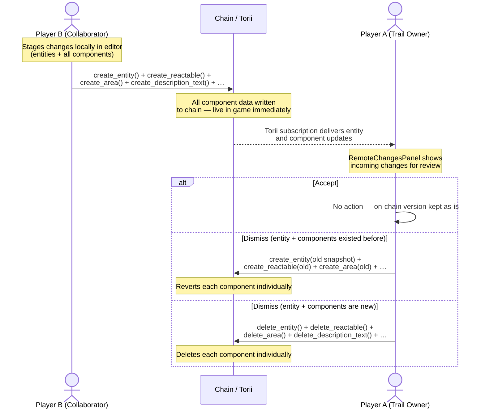
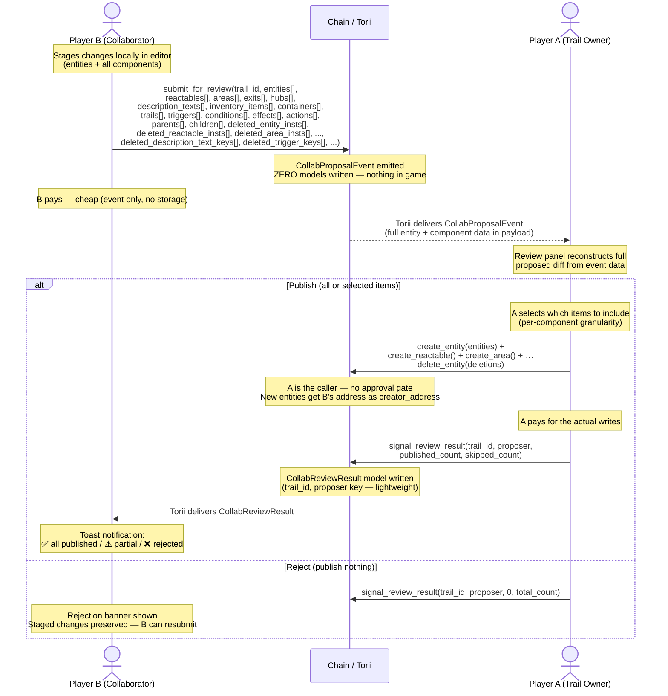

# Collaborative Trail Editing — Proposal Flow Options

Two design options were considered for gating how collaborator changes reach the chain. This document records both options and the implemented solution.

---

## Option 1 — Client-side only (no contract changes)

**DECIDED TO NOT IMPLEMENT**

Player B publishes directly to the chain. Player A reviews after the fact and can accept (keep) or dismiss (revert/delete). Player A pays for any revert transactions.



### Tradeoffs

| | |
|---|---|
| ✅ Zero contract changes | |
| ✅ Simpler proposal logic | |
| ❌ All component data is **live in game** until Player A acts | |
| ❌ Dismiss is expensive — one `create_*` or `delete_*` per component type per entity | |
| ❌ Player A pays for all revert transactions | |
| ❌ Player A must be online to revert; every hour offline = longer exposure of unapproved content | |

---

## Option 2 — Proposal event + owner publishes (implemented)

Player B never writes any model data to the chain. They emit a single proposal event containing the full entity + component snapshot. The trail owner reviews the proposal and **publishes approved changes directly**, then signals the result to the collaborator.

### How Dojo events work

A Dojo event is fundamentally different from a model:

```cairo
// A MODEL — writes a storage slot in the World contract
#[dojo::model]
pub struct Entity { ... }
world.write_model(@entity);     // ← storage cost, on-chain state changes

// AN EVENT — writes nothing to World storage
#[dojo::event(historical: false)]
pub struct CollabProposalEvent { ... }
world.emit_event(@proposal);    // ← no storage cost, emitted into the tx receipt
```

When `world.emit_event` is called:
1. The event data is serialized and emitted into the Starknet **transaction receipt** — the World contract writes **zero storage**
2. Torii watches every transaction, detects the event, deserializes it, and stores it in its own off-chain database
3. Client apps query or subscribe to that data via the Torii SDK

With `historical: false`, Torii keeps only the **latest emission per key combination** — if B resubmits a revised proposal it overwrites the previous one and the owner always sees the most current version.

### Where the data lives at each stage

```
B's browser          Transaction / Chain            Torii (off-chain index)        World State (on-chain models)
─────────────        ───────────────────────        ───────────────────────────    ─────────────────────────────

[staged in           submit_for_review() tx    →    CollabProposalEvent stored     ← nothing written here
 dataPool]           emits the event                in event_messages table
                     with ALL entity +              queryable by (trail_id,
                     component data                 proposer) — latest only

                     Owner calls create_entity()  →                            →   Entity + components
                     create_area() etc. directly                                   written to World state
                     (owner is the caller)

                     signal_review_result() tx  →   CollabReviewResult visible  →  CollabReviewResult written
                                                    in Torii models                to World state
                                                    (lightweight: counts only)     (trail_id, proposer key)
```

| Stage | Where entity + component data lives | World state |
|---|---|---|
| B staging locally | Browser `dataPool` only | Nothing |
| After `submit_for_review` | `CollabProposalEvent` in Torii (event payload) | Nothing |
| During owner review | Event still in Torii | Nothing |
| After owner publishes | Entity + component models | Entity + components live |
| After `signal_review_result` | — | `CollabReviewResult` (counts only) |

### The full flow



### What is on-chain during review

```
Timeline ─────────────────────────────────────────────────────────────────►

  B submits proposal      A reviews             A publishes + signals
        │                     │                        │
        ▼                     ▼                        ▼
  ┌───────────────┐    ┌────────────┐   Publish → ┌──────────────────────┐
  │ Proposal      │    │ Event data │              │ Entity + components  │
  │ EVENT in      │───►│ in Torii   │              │ live in game         │
  │ Torii only    │    │            │              │ CollabReviewResult   │
  │               │    │ Game:      │              │ signals outcome      │
  │ Game: clean   │    │ clean      │              └──────────────────────┘
  └───────────────┘    └────────────┘   Reject  → ┌──────────────────────┐
                                                   │ Nothing published.   │
                                                   │ CollabReviewResult   │
                                                   │ (0, total) signals   │
                                                   │ rejection.           │
                                                   └──────────────────────┘
```

### How Player A knows something is pending

A subscribes to `CollabProposalEvent` filtered by their owned `trail_id`s. Events in Torii signal pending proposals; once the owner signals a result, the collaborator's `CollabReviewResult` model in Torii confirms the outcome.

| `CollabProposalEvent` in Torii | `CollabReviewResult` for proposer | State |
|---|---|---|
| Yes | No (or stale) | **Pending** — A needs to review and publish |
| Yes | Yes (recent) | **Handled** — result delivered to collaborator |
| No | No | Idle — nothing pending |

### `creator_address` behavior

The **owner** is the one calling `create_entity` during publish, so `get_caller_address()` = A. The contract logic preserves the correct creator:

| Entity type | `creator_address` on-chain | How |
|---|---|---|
| Modified (existed, created by A) | Preserved as Player A | Contract reads stored creator; ignores passed value |
| New (proposed by B, published by A) | Player B | Owner passes B's address; contract uses it for new entities (non-zero check) |

The owner passes `creator_address = proposer` for each new entity in the proposal. The contract checks: if the entity is new AND `creator_address.is_non_zero()`, use the passed value; if the entity already exists, always preserve the stored creator.

### Contract changes required

**1 Dojo event** (carries the full proposal payload):

```cairo
#[derive(Drop, Serde)]
#[dojo::event(historical: false)]
pub struct CollabProposalEvent {
    #[key] pub trail_id: u128,
    #[key] pub proposer: ContractAddress,
    // (30 arrays — entity + all component write/delete proposals)
    ...
}
```

**1 Dojo model** — the review result (lightweight, counts only):

```cairo
#[derive(Clone, Drop, Serde, Introspect)]
#[dojo::model]
pub struct CollabReviewResult {
    #[key] pub trail_id:       u128,
    #[key] pub proposer:       ContractAddress,
    pub published_count:       u32,
    pub skipped_count:         u32,
}
```

**2 system functions** in `designer.cairo`:

```cairo
// B emits proposal — no model writes, B pays cheap gas
fn submit_for_review(ref self: ContractState, trail_id: u128, entities: Array<Entity>, ...)

// A signals result after publishing — writes CollabReviewResult
fn signal_review_result(ref self: ContractState, trail_id: u128, proposer: ContractAddress,
                        published_count: u32, skipped_count: u32)
```

**Simplified gate on every `create_*` and `delete_*` function** for collaborator callers:

```cairo
// fires when caller is not admin AND entity belongs to a trail AND caller is not trail owner
assert(false, Errors::NOT_APPROVED);  // collaborators can never write directly
```

### Client changes required

| Area | File(s) | Change |
|---|---|---|
| Collaborator publish flow | `publisher.ts` | Replace individual `create_*` / `delete_*` calls with `submit_for_review` |
| Owner review + publish | `RemoteChangesPanel.tsx` | Reconstruct diff from event payload; **Publish selected** = `publishFromProposal(proposal, selected)` + `signalReviewResult(...)` |
| Result notification | `StagingPanel.tsx` | Watch `CollabReviewResult` via entity subscription; three-state toast / banner |
| Session policy | `wallet.store.ts` | Add `submit_for_review`, `signal_review_result`; remove `approve_proposal`, `reject_proposal` |

### Who sees what — filtering proposals to trail owners

Each player only sees proposals for trails **they own**. Enforced at three independent layers:

#### Layer 1 — Subscription filter (client)

Owner queries `CollabProposalEvent` keyed by their own trail IDs.

#### Layer 2 — UI gate (client)

`RemoteChangesPanel` double-filters: only renders proposals where `trail_id ∈ ownedTrailIds`.

#### Layer 3 — Contract enforcement

`signal_review_result` asserts the caller is the trail owner. Direct `create_*` / `delete_*` calls by collaborators unconditionally panic with `NOT_APPROVED`.

---

### Tradeoffs

| | |
|---|---|
| ✅ Unapproved content — entity AND all components — **never reaches the chain or the game** | |
| ✅ Reject is a no-op — no revert transactions needed | |
| ✅ Full component data in event — A sees the complete proposed diff | |
| ✅ A pays for the writes; B pays only for the cheap proposal event | |
| ✅ `creator_address` correct for new entities — owner passes proposer's address | |
| ✅ Per-component selection granularity — owner can publish/skip individual components | |
| ✅ Audit trail in Torii via the proposal event | |
| ✅ Trail owners only see proposals for their own trails (three-layer filter) | |
| ✅ No intermediate `ApprovedProposal` storage — simpler contract state | |
| ❌ Contract changes required: 1 event + 1 model + 2 functions + gate on all `create_*`/`delete_*` | |
| ❌ Large calldata when submitting many entities — may need batching for big changesets | |

---

## Side-by-side comparison

| Dimension | Option 1 (client-only) | Option 2 (proposal + owner publishes) |
|---|---|---|
| Contract changes | None | 1 event + 1 model + 2 functions + simplified gate |
| Unapproved content in game | **Yes — until A acts** | **Never** |
| Who pays for writes | B (publish) + A (revert) | A (publish), B (submit only) |
| `creator_address` new entities | Player B ✅ | Player B ✅ (owner passes B's address) |
| Reject/dismiss cost | Many on-chain txs | Free — just `signal_review_result(0, n)` |
| Player A offline impact | B's content live in game | Nothing visible |
| Per-component selection | No | Yes — owner selects items in review UI |
| Pending data storage | Not applicable (already on chain) | Torii event payload (off-chain index) |
| Intermediate approval state | None | None (owner publishes directly, no staging step) |
| Collaborator notification | None | `CollabReviewResult` model via Torii entity subscription |
